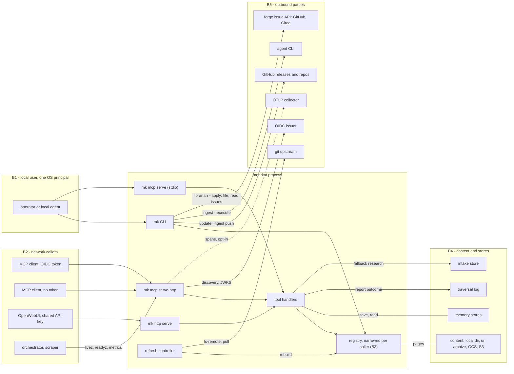

# Threat model

This document is meerkat's threat model. It has six parts: the system and its trust boundaries,
the assets that cross them, the disclosure rule, the threats and controls per surface, where
identifiable request data persists, and the residual risks with the issue that tracks each one.

[SECURITY.md](SECURITY.md) is the companion document. It covers the scanners, how to fix what
they flag, and the audited findings. The model below cites its hardening notes as controls.

It was split out of SECURITY.md on 2026-10-02 (#123, part of the compliance epic #68). Keep it
current: a change that adds a surface, a store, an egress or a credential updates this document
in the same PR (see [Keeping this current](#keeping-this-current)).

## System and trust boundaries

Each boundary below names who sits on either side and what authorizes a crossing.

- **B1, local user.** `mk` commands and the stdio server `mk mcp serve` run as the operating-system
  user who started them. The MCP client spawns the stdio server and talks to it over a pipe. There
  is no authentication, and none is needed: the process acts for exactly one principal, who owns the
  fixed `local` personal-memory namespace. `SIGHUP`, the manual reload, is authorized by the
  operating system: whoever can signal the process could already control it.
- **B2, network callers.** Callers come in three kinds.
  - `mk mcp serve-http` verifies OIDC bearer tokens: signature, `iss`, `aud` (mandatory) and `exp`.
    Policy rules turn a verified identity into grants. An `anonymous: true` rule publishes named
    collections, read-only, to callers with no token.
  - With no `auth:` block at all, serve-http serves every collection to any caller and says so in its
    banner. The default bind is loopback for that reason.
  - `mk http serve` (the OpenWebUI tool server) has one shared API key and no per-caller identity:
    every holder of the key is the same caller.

  `/livez`, `/readyz`, `/metrics`, the RFC 9728 metadata and `/.well-known/security.txt` are
  unauthenticated by design. Neither server terminates TLS.
- **B3, tenant to tenant inside the hosted server.** Many principals share one process. Two controls
  separate them. A collection a caller may not read is filtered out of the registry for the whole
  request, so it is invisible rather than denied. A personal memory is readable only by the
  `(iss, sub)` that wrote it. Both are enforced once, by narrowing the per-request view
  (`Registry.Restrict`, `Registry.ViewedBy`), never per operation. See the design notes below.
- **B4, content and stores.** Content is trusted by configuration: the operator chooses the
  directory, archive or bucket. What meerkat verifies depends on the source type: nothing for a
  local directory, a sha256 for a `url` archive, a generation or ETag for an object store. Memory
  stores, the intake store and the traversal log are written by meerkat and read back by meerkat or
  by the librarian.
- **B5, outbound parties.** Each egress is opt-in or tied to a command the operator ran:
  - OIDC discovery and JWKS fetches, under `auth:`;
  - `git ls-remote` and `git pull --ff-only` to a checkout's upstream, under `remote_check` and
    `on_divergence: pull`;
  - GitHub, for `mk update` and `mk ingest`;
  - the issue API of a collection's forge (GitHub or Gitea), for `mk ingest --role librarian
    --apply`, only when that collection's `merge-request` contract names a `token_env` and the
    variable is set; the API host is derived from the contract's `repo`;
  - an OTLP collector, under `observability:`;
  - the agent CLI that `mk ingest --execute` spawns.

## Assets

The classification uses the company taxonomy: `public`, `internal`, `confidential` and
`restricted`, plus a `personal-data` axis of `none`, `identifier` or `sensitive`. It is
**provisional** until the asset catalogue (MK-A-4, #68) assigns it in `assets/catalog.json`.

| Asset | Where it lives | Class (provisional) | Personal data | Retention today |
| --- | --- | --- | --- | --- |
| KB content (pages, frontmatter) | content source, extraction cache, in-memory index | operator's choice; `internal` default | none, unless the content carries it | the source's |
| Personal memories | memory store, `personal/<sha256(iss, sub)>/` | `confidential` | `identifier` (owner hash) | until deleted |
| Team and global memories, staged proposals | memory store | `internal` | none | until deleted |
| Traversal log entries | `observability.traversal_log` (local or S3) | `internal` | none by default; `identifier` with `query: plaintext` | 90 days by default; `retention_days: 0` keeps everything |
| Intake raw pages | intake store | `internal` | `identifier` (question, session ID, submitter namespace) | until the librarian processes them |
| Access log | process stderr | `internal` | `identifier` (`sub`, `issuer`, `tenant`, peer IP) | the operator's log pipeline |
| Spans and metrics | OTLP collector, `/metrics` | `internal` | none (the disclosure rule) | the collector's |
| OIDC bearer tokens | request headers only | `restricted` | `identifier` | never stored |
| `mk http serve` API key | environment or flag | `restricted` | none | never logged |
| Traversal-log HMAC key | environment (`hmac_key_env`) | `restricted` | none | never in configuration |
| GitHub token (`mk update`, `mk ingest`) | `gh` auth cache, then one env var per subprocess | `restricted` | none | never written |
| Collector credentials | environment (`headers_env`) | `restricted` | none | never in configuration |
| Forge issue token (librarian) | environment, the variable an update contract's `token_env` names | `restricted` | none | never in configuration; read per run |
| Needs-human forge issues | the forge repo of the target collection's update contract | the repo's visibility | `identifier` (initial question) | the forge's; meerkat never deletes them |
| Release binaries, checksums, signatures | GitHub releases, OCI registry | `public` | none | permanent |

## The disclosure rule

The rule is a control with a test behind it, not a convention.

> No query text, page ID, collection name, bucket, object or prefix, memory key, path, commit,
> version token, session ID, OAuth claim or caller identity appears on a span or on a metric
> label. Error text never appears on a span.

- **Why.** A span and a metric leave the trust boundary. A span goes to a collector, often a shared
  or third-party one with longer retention and a wider readership. `/metrics` is unauthenticated.
  The access log stays on the operator's stderr, so it may name the caller. The two surfaces are
  held to different standards on purpose (see
  [Telemetry: two surfaces, two standards](#telemetry-two-surfaces-two-standards)).
- **Where the vocabulary lives.** Every span attribute key is declared in one file,
  `internal/telemetry/attrs.go`. Values come from closed sets, counts, durations, booleans, the
  server's own matched route pattern, or a collection's configuration ordinal.
- **Tests that enforce it:**
  - `TestObservability_NoSpanOrMetricCarriesAForbiddenValue` drives every read surface and walks
    every span and metric label.
  - `TestObservability_LocalRefreshCycleCarriesNoToken` covers the local refresh cycle.
  - `TestObservability_FreshnessCarriesNoNamePathCommitOrToken` covers the remote check and the
    pull.
  - `TestObservability_ZeroConfigurationChangesNothing` pins that with no `observability:` block
    nothing is exported at all.
- **Where it extends.** The same rule governs the unauthenticated endpoints: `/readyz` reports counts
  and states, never names. It also governs the freshness advisory on `mk_search` and `mk_show`, a
  fixed phrase that names only a collection the caller may already read.

## Where identifiable request data persists

Request data that can identify a caller, or reveal what they asked, persists in five places.
All other request data lives only in memory for the duration of the request.

1. **The traversal log** (`observability.traversal_log`, opt-in). It stores one entry per
   `mk_report_outcome`. Collection names and page IDs are HMAC-hashed and the session ID is hashed.
   The caller's initial query is stored only with `query: plaintext`. A librarian deployment
   needs it, because it is the training signal. Entries expire after 90 days unless
   `retention_days` says otherwise (#124).
2. **Intake raw pages** (an intake store, opt-in). Each fallback research report is written as one
   page. Its frontmatter carries the initial query as `question`, the `session_id` as sent, and the
   submitter's namespace hash; its body carries the agent's summary and sources. The pages wait for
   the librarian.
3. **The access log** (stderr, `mk mcp serve-http` only; `mk http serve` keeps none). It records
   method, path, status, peer IP, user agent and MCP session ID, plus `sub`, `issuer` and `tenant`
   for authenticated requests. Retention is whatever the operator's log pipeline keeps.
4. **Personal memories.** These are content the caller chose to save, stored under a namespace
   derived from their identity.
5. **Forge issues for parked intake items** (meerkat-mob #19, opt-in per collection through
   `token_env`). `mk ingest --role librarian --apply` files one issue per parked item on the
   target collection's forge. Its body carries the initial question and the attempted path, which
   names collections in plaintext, beside the parked reason and the validators' failure reasons.
   It stays on the forge, outside meerkat's control, readable by whoever can read that repo.

## Threats and controls by surface

Meerkat is **not** read-only: `mk ingest --execute` writes pages to a
working copy, commits, and pushes them upstream. The threat surface
is small but worth being explicit about:

| Asset | Threat | Mitigation |
|-------|--------|-----------|
| Embedded wiki content | Tampering between source and binary | Content is embedded at build time; `mk version`'s `kb_commit` records the content commit it was built from. The release binary's SHA256 is published and cosign-signed, so consumers can verify the exact bytes — **this mitigation covers embedded content only** (see the next row). |
| Runtime KB content — unverified (`--kb-dir` flag / `MEERKAT_KB_DIR` env var, or a `type: local` `content-source.yaml` source) | Tampering, or malicious content, in a directory an operator points meerkat at | **Not covered by the cosign signature, the checksums file, or `kb_commit`.** `kb_commit` always names the build-time embedded content's commit regardless of what's actually being served — it says nothing about this directory's contents. `mk version`'s `kb_source` field (`disk:<path>`) reports that this kind of content is in effect, so operators and auditors can tell it apart from `embedded`/`url:...` (below), but it is a provenance label, not an integrity guarantee: meerkat performs no signature check, hashing, or sandboxing here. An operator who configures one of these is trusting that directory themselves, at the moment of every invocation — comparable in posture to `--trust-sources` for ingestion (below). |
| Runtime KB content — digest-verified (`type: url` `content-source.yaml` source) | Tampering in transit, or at rest wherever the archive is hosted | **Also not covered by the cosign signature, the checksums file, or `kb_commit`** — same as the row above. What *is* different: the archive's sha256 is checked before anything is extracted or cached (`internal/contentsource.FetchURL`), so tampered bytes are rejected outright rather than served, and extraction itself is hardened against a hostile archive (symlink/hardlink entries skipped, absolute/traversing entry names rejected, writes contained by an `os.Root`, per-file/cumulative/entry-count decompression caps — see "Additional hardening in place" in [SECURITY.md](SECURITY.md#audited-and-accepted-findings)). What the digest does **not** buy: it does not place the archive under the release's cosign signature — that covers the binary's own checksums file, not an arbitrary operator-named URL — and meerkat cannot tell a correct digest for the *wrong* archive from a correct digest for the intended one. The choice of `url`/`sha256` in `content-source.yaml` is still the operator's, unverified by meerkat. `kb_source` reports `url:<url>@<digest12>` so this case is distinguishable from `disk:<path>` at a glance. |
| Runtime KB content — generation-pinned (`type: gcs` `content-source.yaml` source) | Tampering, or an unexpected overwrite, of an object in a Google Cloud Storage bucket an operator points meerkat at | **Also not covered by the cosign signature, the checksums file, or `kb_commit`** — same as the two rows above. What *is* different: GCS assigns a new generation on every write, and meerkat fetches with a conditional read (an explicit generation **and** `ifGenerationMatch`), so the bytes written into a cache entry named `<generation>` cannot be another generation's; the cache key is that generation (bundle mode) or a fingerprint over every listed object's `(name, generation)` (prefix mode), so any overwrite/add/delete invalidates it rather than being served from a stale entry. An explicit `generation:` in the config pins the deployment outright — the current generation is never consulted, so a later overwrite cannot change what this binary serves. `sha256:` is optional here (the generation already pins the bytes) and is verified before extraction when set. Bundle extraction reuses the same hardened `type: url` extractor; prefix mode applies the same entry-name validation and `os.Root` containment to object names, plus per-file/cumulative/object-count caps. **Credentials:** Application Default Credentials / Workload Identity Federation only — the schema has no field for a static service-account key, so meerkat cannot be configured to read one. Access control on the bucket is Google Cloud IAM's; meerkat adds none of its own, and any principal that can read the bucket can serve its content. `kb_source` reports `gcs://<bucket>/<object>@<generation>`. |
| Runtime KB content — **hot-reloaded** (`type: gcs` with a `refresh:` block) | An operator who believes a deployment is pinned when it is in fact following the bucket; a hostile or broken new generation being served, or taking the process down with it | Opting in is explicit and **mutually exclusive with pinning**: `generation:` and `refresh:` together are refused at config load, because a file that carries both has two contradictory readings and one of them silently revokes the reproducibility guarantee. `Source.Refreshable()` re-asserts the same rule at runtime, so the failure direction stays closed — the worst outcome of a validation gap is a source that does not move. Everything a refresh actually does is the startup path: the same conditional reads (explicit generation **and** `ifGenerationMatch`), the same `os.Root`-contained writes and entry-name validation, the same per-file/cumulative/object-count caps, the same ADC-only client with no key-file field. What is *added* is that the expensive work happens off the request path into a **staging cache entry keyed by the new version**, and is published as one atomic snapshot swap — so a partially downloaded, partially parsed or partially indexed generation is never visible, a failed refresh cannot delete or corrupt the last known-good cache entry, and the collection keeps serving the previous generation and is marked **degraded** rather than emptied or taken down. Polling is metadata-only (`refresh.interval` has a 5s floor) and there is no inbound path: no webhook, no Pub/Sub, no HTTP reload endpoint. The manual trigger is `SIGHUP`, authorized by the operating system — you can send it only if you could already signal the process. `kb_source` follows the bytes, so it reports the generation currently being served rather than the one the process started on. See [design/hot-reload.md](design/hot-reload.md). |
| Runtime KB content — **scheduled rebuild** (`type: local` with a `refresh:` block, meerkat-mob#25) | Mounting a knowledge base becoming code execution; a timed rebuild serving an empty or half-built index; a local path or commit leaking into telemetry | The probe is `kb.FingerprintFS`: one stat per candidate page, over the **same** walk `kb.ListFS` reads, hashing `(path, size, mtime)`. It reads no page content and no git metadata, and it **invokes nothing**: no `git`, no shell, no hook or config the repository supplies (MK-SEC-12). A rebuild is the SIGHUP rebuild: it holds the reload slot, arms the write journal, builds off the request path, and publishes by one pointer swap. A failure leaves the last known-good index serving and marks the collection degraded under its `failure_policy`. A subdirectory that vanishes mid-walk (a pull deleting it) is skipped rather than read as "no content root", so a rebuild racing a pull cannot swap in an empty index. No metric or span gains a label: the refresh series stay labelled by ordinal and kind. The token is reported as `Outcome.LogVersion`, which the controller logs and never puts on the cycle span, so it travels in the structured status and the log only (MK-FRESH-10); `TestObservability_LocalRefreshCycleCarriesNoToken` runs a cycle and checks every span. A collection without the block emits exactly the spans it did before. Without the block nothing polls, and `mk mcp serve` starts no controller at all unless a `type: local` collection has one (MK-FRESH-09); stdio never polls an object or memory store. Unknown keys in any `refresh:` block are refused at load, so a typo or a key from a later release cannot load silently as the defaults. **The git half (part B, opt-in), against MK-SEC-12 (meerkat-mob 4f3cbb7):** "A freshness probe shall read plain files only and never invoke git; the only git invocations shall be the opt-in pull path (`git status --porcelain`, then `git pull --ff-only`) and the opt-in remote check (`git ls-remote`), each with a fixed argument vector, no shell and no repository-supplied hooks or configuration honoured, so mounting a knowledge base never becomes code execution." **Git identity is READ** (the commit, the tracking branch, the remote URL) from `.git` files. Every read is size-capped, a non-regular file (a planted FIFO) is refused, no `[include]` is followed and no `insteadOf` is applied. **`ls-remote` runs outside the knowledge base:** an empty temp working directory, with discovery stopped there, and the URL passed after `--`. None of the KB's own config applies. **`GIT_ALLOW_PROTOCOL=https:ssh:git`**, an environment allowlist (`PATH`, `HOME`, `SSH_AUTH_SOCK`), no prompts and a 30 s timeout. **Each protection has a test that fails without it:** `TestLsRemote_RunsOutsideTheKB`, `TestLsRemote_URLIsNeverAnOption` and `TestLsRemote_TransportsArePinned`. **Option-shaped names are refused.** A remote or branch name from the KB's config that starts with `-`, or is not a plain name, is refused before `git pull` sees it, because pull forwards both to fetch without a `--` (`TestUpstreamAndPull_RefuseOptionShapedNames`). **`pull`** runs with `core.hooksPath=/dev/null` and `core.fsmonitor=false`, fast-forward only, on a clean tree. A dirty or diverged tree is reported and left byte-identical. **A remote check never degrades a collection.** Its errors (which may name a URL) go to the log only, and the record carries fixed phrases. **Residual, a deviation from "no … configuration honoured":** `pull` runs inside the repository, so git reads that repository's own local `.git/config` there (a checkout filter driver, an `insteadOf`). That file is written locally, never cloned, and running `pull` is the operator's opt-in. **The surfaces (part C) add no path, commit or URL to an unauthenticated or agent-facing channel.** The advisory on `mk_search` / `mk_show` is a fixed phrase naming the collection and the state, at most 240 bytes. It is a separate item, never inside page text, and only for collections the caller may read. `meerkat_collection_freshness`'s only label is the state. Commits and the remote tip appear only in authenticated `mk_list_collections` and the local CLI. `mk collections status` goes through `ProbeRemote`, which never pulls (`TestRemote_ProbeNeverPulls`, `TestCollectionsStatus_NeverPulls`). |
| Runtime KB content — **tree manifests** (`tree:` in `content-source.yaml`, `manifest.yaml` in each knowledge base) | A knowledge-base maintainer, who is not the operator, using a manifest to make meerkat read, write or run something the operator never chose: a host directory, another bucket, an arbitrary endpoint, a memory store | A manifest's children are **requests checked against an operator allowlist**, `manifest_children:` in `content-source.yaml` (types, buckets, endpoints, https URL prefixes, local directories). Absent, a child may only be an object-store prefix or object in the tree root's own bucket through the root's own endpoint (or the provider default); `local` and `url` children are refused until listed. A `local` child must resolve, after symlinks, under a listed directory, is re-checked when a lazy child is mounted, and never resolves inside meerkat's cache directory, whatever the policy. A relative `local` path resolves against the manifest's own directory, never the operator's config directory. No child may overlap the deployment's `memory:` or `intake:` store. Whatever the policy, a manifest may not declare `memory:`, `update: {method: direct}` (on a child or as its `contract:`), `refresh.remote_check`/`on_divergence`, or `token_env`. Git hardening for in-repo calls is a separate control. See [design/tree.md](design/tree.md#what-a-manifest-may-declare). |
| Shared GCS **memory** store reconciliation (`memory.refresh`) | A personal memory becoming readable by the wrong principal when it is re-read on another replica; a staged (unreviewed) proposal being published by a reload | The rebuilt overlay derives every page ID from the **store key** (`memory.Page(key, body)`), never from a `memory_namespace:` field the document's own bytes could claim — so a personal memory re-read on a second replica is private to exactly the principal who wrote it, and is answered as `not found` to everyone else, identically to a page that never existed. The rebuilt index contains **every** document, private ones included, because visibility is a mandatory clause in the query rather than an index-time filter (an index-time filter would hide a memory from its own owner). The reload's cheap probe and its `Load` share one "is this a live document" decision, so the staging prefix is excluded from both: writing a proposal neither publishes it nor triggers a fleet-wide reload. `TestViewedBy_SurvivesARemount` exercises the property over both a fresh mount and a live, serving collection. |
| User's GitHub token (used by `mk update` and `mk ingest` git auth) | Disclosure via argv, on-disk config, or logging | The token (from the `gh` auth cache) is handed to the clone/fetch subprocess only via a `credential.helper` script that reads it back from an env var (`MEERKAT_GIT_TOKEN`) at request time — it never appears in argv, in the persisted remote URL, or in `.git/config`. The remote URL is scrubbed back to its tokenless form in a `defer` immediately after clone/fetch, including on error paths, so a live credential doesn't linger in the cache dir. |
| Downloaded release binary (in `mk update` flow) | Supply-chain swap | SHA256 verified against published `checksums.txt`; cosign signature on the checksums file (Rekor-logged) — required: `mk update` refuses to install when `cosign` is missing, and the `--skip-cosign` escape hatch needs `MEERKAT_UPDATE_ALLOW_UNVERIFIED=1` plus a typed confirmation on a terminal; a skipped install is trusted only as far as the release page itself (the checksums file then adds no authenticity), and is reported as `cosign:  SKIPPED`; staged in a user-owned temp dir before final copy/move; `.old` backup during swap |
| `mk mcp serve-http` — who may reach which collection | An authenticated caller reading a collection they aren't entitled to, or *learning it exists* | Bearer tokens are verified as real OIDC tokens (signature against the issuer's JWKS, `iss`, `aud`, `exp`) by `github.com/coreos/go-oidc`; discovery runs at startup so a bad issuer fails the process rather than producing intermittent 401s. **Audience is mandatory** — a provider with no `audience` and no `auth.resource` is refused at construction, because an audience-unbound resource server accepts tokens minted for any other relying party of the same IdP. Authorization is applied by *narrowing the registry* once per request (`collections.Registry.Restrict`), not by a per-operation check: a collection the caller can't read is absent from `Names`/`All`/`Get`/`target`/`SplitQualified` and therefore from search, list, show, the MCP tool descriptions, the `available: …` list in an error, and `mk_show`'s ambiguity count. See the note below on why that distinction is the security property. Policy validation runs at config-load time (unknown capability, rule with no collections, non-https issuer, rules without providers) so a policy that would silently grant nothing fails the process instead. |
| `mk mcp serve-http` — who may read another principal's PERSONAL memory | A caller reading, enumerating or inferring the existence of a memory somebody else saved for themselves | A personal memory is readable only by the principal whose namespace it is in — the verified `(iss, sub)` pair, never a tool argument, and never a mutable claim like email/groups/tenant. Enforcement is by *narrowing the per-request registry view* once (`Registry.ViewedBy`), exactly as collection authorization narrows it, so search, list, show, page counts, snippets and `mk_show`'s ambiguity count all inherit it rather than each checking. In search the filter is a **mandatory clause inside the bleve query**, boosted to zero, so ineligible documents are excluded before ranking and before the `limit` truncation — a post-filter over the top N would both leak metadata and silently return an empty result when the limit was consumed by hidden documents. An unauthorized read answers `not found`, byte-identical to a page that was never written, for bare and qualified IDs alike. `admin` does not confer it: capabilities are held over a collection, and ownership is not a capability. An operator may opt a collection back into the old collection-wide behaviour with `memory.personal_visibility: collection`, which logs a startup warning under OIDC. See [design/memory.md](design/memory.md#private-personal-reads-27). |
| `mk mcp serve-http` — collections **published** to anonymous callers (`anonymous: true` policy rule) | An operator publishing more than they meant to; an unpublished collection leaking to an anonymous caller; an expired or forged token being quietly downgraded into partial access | **Explicit, opt-in, read-only, and authenticated-by-default around it.** A collection is published only by a rule that names it: absent any `anonymous:` rule the server 401s a token-less request exactly as before (pinned by `TestHostedAnonymous_NoAnonymousRuleChangesNothing`), and a rule with **no selector** still means "every *authenticated* caller", so an existing policy publishes nothing by upgrading. Validation refuses `personal-write`/`team-write`/`global-write`/`admin` on an anonymous rule, refuses combining it with a claim selector (`subjects`/`emails`/`groups`/`tenant`/`issuer`), refuses it with no `providers:`, and refuses it alongside `allow_unauthenticated` — which already publishes *everything* and would silently widen the rule's collection list to all of them. There is **no second authorization path**: the gate synthesizes ordinary `*authz.Grants` over an identity with no subject, so the anonymous caller is an ordinary restricted caller and inherits the registry narrowing, the rebuilt tool descriptions, the invisibility of every unpublished collection (guessed IDs, `<hidden>:<id>`, explicit `collection` argument and ambiguity counts all answer as never-mounted), and #27's rule that a subjectless caller owns and reads **no** personal memories. **A present-but-invalid token is never downgraded**: expired, forged, wrong-audience, wrong-issuer, malformed, `Bearer` with an empty value and a non-Bearer scheme all keep their 401 and their `WWW-Authenticate` challenge whatever the policy publishes — a silent downgrade would mask an expiry as partial data and remove the only signal that tells a client to refresh. **What is intentionally disclosed** is stated in its own section below, including the update-contract repo URL. Telemetry classifies the admission with one bounded value (`meerkat.authn.result=anonymous`) and one unlabelled counter (`meerkat_auth_anonymous_total`), and the access log records `"auth":"anonymous"` with no invented identity fields. See [design/hosted-mcp.md](design/hosted-mcp.md). |
| `mk mcp serve-http` unauthenticated endpoints (`/livez`, `/readyz`, `/metrics`, `/.well-known/oauth-protected-resource`, `/.well-known/security.txt`) | Enumeration of the deployment by an unauthenticated caller | Probes and metrics are deliberately unauthenticated (an orchestrator and a scrape job have no OIDC token, and a probe that can fail for auth reasons restarts healthy pods), so they are written to carry nothing: `/readyz` reports **counts and state, never collection names** — ready/degraded/total, with the names, bucket, generation and error text behind a failure going to the structured log instead; no metric carries a collection name, bucket, object path, memory key, page ID, query or caller subject as a label; the `route` label is the server's own matched mux pattern from a closed set, never `r.URL.Path`, so a scanner can't add time series. The refresh series (`meerkat_refresh_*`) are labelled by the collection's configuration **ordinal** and a two-value kind, and deliberately **not** by the source generation or fingerprint — that increments forever, so one series per publication would be an unbounded cardinality leak as well as a disclosure; the version travels in the log and in authenticated collection discovery. The RFC 9728 metadata is public by definition — its job is to be readable by a client that has no token yet — and contains only the resource identifier and the configured issuers. `/.well-known/security.txt` (RFC 9116, #126) is public by definition too. It names the meerkat software's security contact and policy, the same on every deployment, so it says nothing about this one; `--security-txt=false` turns it off. `mk http serve` serves the same file as a public route. `GET /` names no collection, and `mk http serve`'s public `GET /openapi.json` names none unless the request carries the API key (`TestAnonymousRoutesNameNoCollection`). |
| `mk mcp serve-http` started with **less authentication than the operator wrote** (mistyped or empty `auth:` block, `--kb-dir`/`MEERKAT_KB_DIR` dropping the block) or exposed with none | An operator mistake becoming full exposure of every collection on a reachable address | **Every misconfiguration that would remove authentication fails startup or needs an explicit opt-in.** The `auth:` subtree is decoded strictly (an unknown key is an error, nested ones included; the rest of `content-source.yaml` keeps its lenient decoding). A present `auth:` block with no providers is refused unless `allow_unauthenticated: true` is written. `--kb-dir`/`MEERKAT_KB_DIR` still suppresses `auth:` discovery, now with a warning naming it. `serve-http` refuses a non-loopback bind (including the address of a socket-activated listener) when no authentication is configured, unless `--insecure-no-auth` is given (`TestCheckUnauthenticatedBind`, `TestAuthBlock_MistypedKeyFailsClosed`, `TestAuthBlock_EmptyBlockNeedsExplicitOptIn`). |
| `mk mcp serve-http` unauthenticated endpoints (`/livez`, `/readyz`, `/metrics`, `/.well-known/oauth-protected-resource`, `/.well-known/security.txt`) | Enumeration of the deployment by an unauthenticated caller | Probes and metrics are deliberately unauthenticated (an orchestrator and a scrape job have no OIDC token, and a probe that can fail for auth reasons restarts healthy pods), so they are written to carry nothing: `/readyz` reports **counts and state, never collection names** — ready/degraded/total, with the names, bucket, generation and error text behind a failure going to the structured log instead; no metric carries a collection name, bucket, object path, memory key, page ID, query or caller subject as a label; the `route` label is the server's own matched mux pattern from a closed set, never `r.URL.Path`, so a scanner can't add time series. The refresh series (`meerkat_refresh_*`) are labelled by the collection's configuration **ordinal** and a two-value kind, and deliberately **not** by the source generation or fingerprint — that increments forever, so one series per publication would be an unbounded cardinality leak as well as a disclosure; the version travels in the log and in authenticated collection discovery. The RFC 9728 metadata is public by definition — its job is to be readable by a client that has no token yet — and contains only the resource identifier and the configured issuers. `/.well-known/security.txt` (RFC 9116, #126) is public by definition too. It names the meerkat software's security contact and policy, the same on every deployment, so it says nothing about this one; `--security-txt=false` turns it off. `mk http serve` serves the same file as a public route. `GET /` names no collection. |
| `mk mcp serve-http` **socket activation** (systemd `LISTEN_FDS`, #110) | Serving on a socket the operator did not mean (an inherited parent's, the wrong one of several, a connected `Accept=yes` socket); an unauthenticated server reachable on an address the operator did not see; the inherited socket or its variables leaking into a child process | `sd_listen_fds(3)` is followed exactly: the variables are honoured only when `LISTEN_PID` is this process's own, exactly one socket is accepted (several are refused with the count, not guessed between), and a socket that is not listening is refused with `Accept=no` named as the fix. The inherited fd is marked close-on-exec, and `LISTEN_PID`, `LISTEN_FDS` and `LISTEN_FDNAMES` are unset before any child can be spawned. The startup line names the socket's **real** address, not `--host`/`--port`, since that address is what decides who can reach a server with no `auth:` block. DNS-rebinding protection is unchanged: it reads each connection's local address, which is the inherited socket's. Off Linux the variables are ignored. |
| `mk mcp serve-http` access logs | Credential or membership disclosure via logging | The `Authorization` header, the raw token, group membership and request bodies are never logged. Logged: method, path, status, duration, bytes, peer, user agent, MCP session ID, and (authenticated only) `sub`/`issuer`/`tenant` — an audit trail without a directory dump. `X-Forwarded-For` is deliberately **not** consulted: it is client-controlled unless a trusted proxy rewrites it, and meerkat has no way to know that. **The server has no TLS of its own**; default bind is loopback. Exposed beyond one host without a TLS-terminating proxy, bearer tokens and every response body cross the network in plaintext. |
| `mk mcp serve-http` **telemetry export** (`observability:`) | Request metadata leaving the process to a collector — frequently a shared one, frequently a third party's — and carrying more than the operator realised; a plaintext export across a cluster network; a collector credential ending up in a committed config file; an exporter outage becoming an availability incident | **Opt-in and off by default.** With no `observability:` block and no `OTEL_*` variable no SDK is constructed at all — no spans, no exporter, no goroutine, no socket — and `/metrics` and the JSON logs are byte-identical to what they were (pinned by `TestObservability_ZeroConfigurationChangesNothing`). **Data classification:** a span is exported OUT of the trust boundary, so it is held to a stricter rule than the access log beside it. Spans and the new metrics carry only counts, durations, booleans, outcomes from a closed set, the server's own matched route pattern, and a collection's configuration ORDINAL. Never: query text, page IDs, page or memory content, tags, memory keys, collection names, bucket/object/prefix names, bearer tokens, any OAuth claim, the OIDC subject/email/groups/tenant, MCP session IDs, or `r.URL.Path`. The access log deliberately still carries `sub`/`issuer`/`tenant` — it stays on the operator's stderr; identity is **not** on a default span, and correlating a trace to a principal is a separate decision that has not been made. Error TEXT is never recorded on a span either (meerkat's messages quote queries, collection names, buckets); spans get a classified outcome and the log gets the sentence. This is structural, not only a convention: an allowlist span processor in front of the exporter queue drops every attribute outside `meerkat.*` and a declared semconv set and renames spans from third-party instrumentation, and the object-store clients disable their built-in HTTP instrumentation (a test runs the real client against a fake endpoint with the global provider installed). `telemetry.End` records an error class, never its text. `TestObservability_NoSpanOrMetricCarriesAForbiddenValue` drives every read surface and walks every recorded span and metric label asserting each of those classes is absent. **TLS on by default:** a plaintext `http://` collector endpoint is refused at config load unless `otlp.insecure: true` is written out, and `OTEL_EXPORTER_OTLP_INSECURE` cannot revoke a posture the file stated. **No credentials in `content-source.yaml`:** there is no `headers:` field, only `headers_env:`, which names an environment variable read at startup — the same reasoning that gives `type: gcs` no key-file field, and a test asserts the schema marshals no `headers:`/`token:`/`api_key:`/`password:` key. **No inbound surface:** the collector endpoint comes from configuration/environment only; no MCP request, header or tool argument can name an endpoint or add a header. Trace context is correlation data, never authorization data, and W3C baggage is not propagated in either direction. **Never an availability dependency:** the span queue is bounded and drops rather than growing (`meerkat_otel_spans_dropped_total`), export failures are counted (`meerkat_otel_export_failures_total`) and log-rate-limited, and the shutdown flush is bounded, so a dead collector cannot fail `/readyz`, fail a search or hold a pod in Terminating. See [design/observability.md](design/observability.md). |
| `mk mcp serve-http` **telemetry export** (`observability:`) | Request metadata leaving the process to a collector — frequently a shared one, frequently a third party's — and carrying more than the operator realised; a plaintext export across a cluster network; a collector credential ending up in a committed config file; an exporter outage becoming an availability incident | **Opt-in and off by default.** With no `observability:` block and no `OTEL_*` variable no SDK is constructed at all — no spans, no exporter, no goroutine, no socket — and `/metrics` and the JSON logs are byte-identical to what they were (pinned by `TestObservability_ZeroConfigurationChangesNothing`). **Data classification:** a span is exported OUT of the trust boundary, so it is held to a stricter rule than the access log beside it. Spans and the new metrics carry only counts, durations, booleans, outcomes from a closed set, the server's own matched route pattern, and a collection's configuration ORDINAL. Never: query text, page IDs, page or memory content, tags, memory keys, collection names, bucket/object/prefix names, bearer tokens, any OAuth claim, the OIDC subject/email/groups/tenant, MCP session IDs, or `r.URL.Path`. The access log deliberately still carries `sub`/`issuer`/`tenant` — it stays on the operator's stderr; identity is **not** on a default span, and correlating a trace to a principal is a separate decision that has not been made. Error TEXT is never recorded on a span either (meerkat's messages quote queries, collection names, buckets); spans get a classified outcome and the log gets the sentence. `TestObservability_NoSpanOrMetricCarriesAForbiddenValue` drives every read surface and walks every recorded span and metric label asserting each of those classes is absent. **TLS on by default:** a plaintext `http://` collector endpoint is refused at config load unless `otlp.insecure: true` is written out, and `OTEL_EXPORTER_OTLP_INSECURE` cannot revoke a posture the file stated. **No credentials in `content-source.yaml`:** there is no `headers:` field, only `headers_env:`, which names an environment variable read at startup — the same reasoning that gives `type: gcs` no key-file field, and a test asserts the schema marshals no `headers:`/`token:`/`api_key:`/`password:` key. **No inbound surface:** the collector endpoint comes from configuration/environment only; no MCP request, header or tool argument can name an endpoint or add a header, and a file `endpoint:` beats every `OTEL_EXPORTER_OTLP_*ENDPOINT` variable. Collector credentials are never sent in the clear: `headers_env` (or `OTEL_EXPORTER_OTLP_HEADERS`) with `insecure: true` towards a non-loopback endpoint is refused at config load. Trace context is correlation data, never authorization data: the root span is created before authentication, so an inbound `traceparent` is honoured only from peers named in `traces.trusted_sources` (TCP peer address; default none), and every other caller gets a fresh, locally sampled root, so a caller can neither force sampling nor choose a trace ID. A token bucket (`traces.max_spans_per_second`, default 1000) caps spans handed to the exporter queue. W3C baggage is not propagated in either direction. **Never an availability dependency:** the span queue is bounded and drops rather than growing (`meerkat_otel_spans_dropped_total`), export failures are counted (`meerkat_otel_export_failures_total`) and log-rate-limited, and the shutdown flush is bounded, so a dead collector cannot fail `/readyz`, fail a search or hold a pod in Terminating. See [design/observability.md](design/observability.md). |
| `mk http serve` API key, and the traffic it guards | Disclosure — in code/logs, or on the wire | Key comparison is constant-time (`subtle.ConstantTimeCompare`), the key is never echoed, and the server refuses to start without one. **The server has no TLS of its own** (`ListenAndServe`, never `ListenAndServeTLS`) — default bind is loopback (`127.0.0.1`). Exposed beyond one host without a TLS-terminating reverse proxy in front, the bearer token and every response body cross the network in plaintext. See `docs/INTEGRATION-OPENWEBUI.md` for the reverse-proxy pattern. |
| `mk ingest --role librarian --apply` files and reads forge issues (meerkat-mob #19) | The forge token sent to a host the operator did not choose; the token leaking through config, logs or errors; content forging an un-park; request data published beyond the deployment | **The operator chooses both the credential and the host.** `token_env` names an environment variable; a value not shaped like a variable name is refused at load, so a pasted token fails before it is committed. Only `content-source.yaml` may set it: a `manifest.yaml` naming `token_env`, in its contract or a child's source, is refused at load (`TestManifest_RefusesTokenEnv`, `TestResolveRuntimeCollections_TreeTokenEnvOnlyFromOperator`), since a manifest is written by the KB maintainer and would otherwise pick a variable from the librarian's environment and, through `repo`, the host it goes to. The API endpoint is derived from that `repo` only (`forge.Resolve`), always https; nothing a page or issue supplies is followed. `Resolve` accepts only a host name (no `/`, so an scp-style `git@evil/x:o/r` is refused) and path segments of `[A-Za-z0-9._-]`, and refuses `?`, `#` and `%` anywhere in the address, so nothing in it can move the token to another API path (`TestResolve_Rejects`). **The token** is never logged or put in an error (`TestCall_ErrorsNeverCarryTheToken`); requests use one 30 s timeout and a 1 MiB response cap, and every listing is capped at ten pages. **Un-parking** follows only an issue on the forge the contract names now, compared by host kind, API root and repo, so a contract moved from `github.com/org/x` to a GitHub Enterprise `org/x` does not follow the old issue (`TestEscalate_ForeignIssueReferenceIsNotFollowed`, `TestEscalate_SameSlugOnAnotherServerIsNotFollowed`). A parked reason cannot forge the marker's `## forge issue` section (`TestPark_ReasonCannotForgeTheIssueSection`), and a marker written before forge issues existed, whose reason was not quoted, is never read as an issue reference (`TestParkedDetail_LegacyMarkerIsNeverAnIssueReference`). **Issue text** fences agent- and validator-written text, and renders the one-line fields (the attempted path an agent sent to `mk_report_outcome`, the collection derived from it) as code spans with backticks and control characters replaced, so a mention or link in them neither pings anyone nor renders (`TestIssueBody_AgentTextCannotLeaveItsCodeSpan`); `mk_report_outcome` refuses list entries with backticks or control characters in the first place. **Duplicates:** a filing is claimed in the marker before the forge call, and an unrecorded earlier claim makes the next run adopt the issue it finds by the marker's first line instead of filing again; a duplicate that still slips through is reported by URL (`TestEscalate_AdoptsTheIssueAnInterruptedRunFiled`, `TestEscalate_ConcurrentFilingReportsTheDuplicate`). **Telemetry:** `meerkat_librarian_filed_issues_total` is labelled by forge kind from a closed set; no URL, repo or title is a label. What the issue discloses is in [Where identifiable request data persists](#where-identifiable-request-data-persists). |
| `mk ingest --execute` spawns an agent CLI (`opencode` or `claude`) | Prompt injection: `Task.Prompt` is rendered from `ingestion/prompts/*.md` in the ingested content source, so a malicious prompt file in any source repo in `sources.yaml` is an arbitrary-action path, running with `cmd.Dir`/`--dir` set to a working copy that holds push credentials, at the operator's full privilege. The generated instruction itself includes a `git push` recipe. | Ingested content is treated as **trusted input** to the agent — meerkat does not sandbox or vet it. The real control is permission prompts: by default the agent CLI runs *with* its normal permission prompts, so an injected instruction still has to get past those before it acts. `--trust-sources` disables the prompts (passes `--dangerously-skip-permissions` to the agent CLI) for unattended/CI runs; it prints a stderr warning before executing. Operators who enable `--trust-sources` must trust every source repo listed in `sources.yaml` — as much as they trust code they'd merge unreviewed. |
| Templates / prompts / sources.yaml | Tampering at build time | Embedded at build time; `make security` includes them in the gosec walk. **When served from a runtime content source instead** (`--kb-dir`/`MEERKAT_KB_DIR`, or a `content-source.yaml` `type: local`/`type: url`/`type: gcs`/`type: s3` source), the rows above apply here too: unverified for `disk:<path>`, digest-verified (with the same caveats) for `url:<url>@...`, version-pinned for `gcs://...` (generation) and `s3://...` (ETag) — either way, outside the gosec walk and the cosign-signed release. |

## Design notes

The controls above that are easiest to get wrong, and why each one is shaped as it is.

### Collection authorization: invisible, not denied

`mk mcp serve-http`'s access control has one rule worth stating on its
own, because the intuitive implementation of it is insecure.

A collection a caller may not read is **invisible** — filtered out of the
registry at the start of the request, so every surface downstream behaves
as if it were never mounted. It is *not* denied per operation.

The difference is not cosmetic. meerkat's multi-collection routing (see
[design/multi-collection.md](design/multi-collection.md)) is full of
messages that name collections, deliberately, to make errors actionable:

- `mk_show`'s ambiguity error lists every collection holding a page ID,
  so the caller can re-ask with a qualified one;
- an unknown-collection error ends `available: <the mounted set>`;
- the MCP tool descriptions name the mounted collections, which is how a
  client discovers them without an extra tool call.

Under a per-operation 403, each of those becomes an **enumeration
oracle**: an authenticated caller with no access to anything learns the
name of every collection, and — via the ambiguity error — which
documents live in which. For a knowledge base the names are frequently
the sensitive part (`incident-2026-03-payments`,
`acquisition-target-research`). A 403-vs-404 split on `mk_show` is a
per-page existence oracle on top of that.

Filtering the registry closes all of them at once, and closes the ones
added later for free. Specifically:

- the ambiguity count and its suggested qualified IDs reflect the
  caller's view, so a page in three collections is unambiguous for a
  caller who can read one;
- a hidden collection name produces a byte-identical error to a
  never-mounted one, `available:` list included;
- `<hidden>:<page-id>` stops parsing as a collection qualification and
  404s as a bare page ID;
- in a `tree:` deployment the same holds for tree paths and tree
  metadata: a path through or to a hidden knowledge base, and a hidden
  cold child, answer as a path nobody declared, and the listings' `path`,
  `parent` and `children` name only what the caller can see (see
  [design/tree.md](design/tree.md#restricted-views));
- `tools/list` and `tools/call` are both rebuilt through mcp-go's tool
  filter, so a caller with no readable collection is offered no KB tools
  and cannot invoke them either.

The one thing meerkat *does* say plainly is that a caller has no access
at all: a token that verifies but matches no policy rule gets **403**.
That is a statement about the caller, identical whether the deployment
mounts one collection or fifty, and it names none of them.

### Published collections are an intentional disclosure surface

An `anonymous: true` policy rule publishes the collections it names to
**anyone who can reach the endpoint**, with no token. That is the
feature. It is worth being explicit about what it costs, because the
rest of this document is about keeping things from leaking and this is
the one place meerkat leaks on purpose.

**What an anonymous caller gets.** Exactly the published collections and
nothing else: every page in them, their titles and IDs, their
frontmatter, their page counts, their `type` and `source` provenance
string, and — the part that surprises people — the collection's
**update contract**. If a published collection declares
`update.method: merge-request`, `mk_list_collections` hands the
contribution repo URL, host, branch and path to unauthenticated callers,
because that is what the field is *for* and a caller who cannot see it
cannot contribute. If that repo URL is not something you want on the
internet, do not put an `anonymous:` rule on the collection that names
it.

**What they do not get, structurally rather than by promise.** Anonymous
grants are read-only by validation, so no write tool is offered and none
can be invoked. They carry no subject, so they own no personal
memories and can read none — #27's rule, unchanged. Every unpublished
collection stays *invisible* to them under the same registry-narrowing
that hides an unauthorized collection from an authenticated caller: a
guessed ID, a qualified `<hidden>:<id>`, an explicit `collection`
argument and an ambiguity count all answer as they would for a
collection this deployment never mounted.

**The gate does not soften.** A token that is expired, forged, minted
for another audience or simply malformed gets **401**, whether or not
the server publishes anything. It is never downgraded to anonymous
access — an expiry that silently degraded into partial data would be an
outage nobody sees, and the 401 challenge is the only thing that tells a
client to refresh.

**Two things to check before publishing.** First, the collection's
content: `mk list --collection <name>` is what the internet will see.
Second, `allow_unauthenticated` — it publishes *everything* and is
refused in combination with an `anonymous:` rule for exactly that
reason.

### Personal memories: private to read, not just to write

`mk_save_memory`'s `personal` scope means private in both directions.
The reasoning is the same one behind invisible collections, and the
mistakes available here are the same shape, so it is worth stating the
three decisions that carry it.

**Ownership comes from the page ID.** A personal memory is stored at
`personal/<namespace>/<slug>.md` and served at page ID
`memory/personal/<namespace>/<slug>`, where the namespace is
`sha256(iss + "\x00" + sub)`. Every read surface derives the owner from
that ID. The alternatives were a frontmatter field (which the document's
own caller-written bytes could claim) or a struct field stamped by a
constructor (which a constructor could forget to set, producing a
*public* page — a silent failure in the wrong direction). Deriving from
the ID has neither failure mode: the ID is built from the verified
identity and from no caller input, so it is an unforgeable carrier.
`memory/personal/` is therefore a **reserved page-ID prefix**: an
ingested content page that happens to sit under it is treated as private
too, which is the safe direction.

**Filtering happens before ranking and truncation.** The visibility
condition is a clause in the bleve query, conjoined with the content
clauses and boosted to zero so it changes eligibility and not relevance.
Post-filtering the top N results would be a security bug *and* a
correctness bug: a caller whose ten best-scoring documents were somebody
else's private memories would receive an empty result and be told,
truthfully from its point of view, that the knowledge base has no
answer. A test pins this with fifty private documents that outrank the
one public match and a limit of five.

**Unauthorized is indistinguishable from nonexistent.** A guessed ID —
bare, qualified as `<collection>:<id>`, or with an explicit `collection`
argument — produces the same answer as an ID nobody has ever written.
The ambiguity error counts only pages the caller may see, so the same
personal key saved into two collections is an ambiguity for its owner
and a plain not-found for everyone else. Page counts in
`mk_list_collections` do not move when another principal saves. Link
status follows the same rule: a `related:` link or pointer target that
names someone else's personal memory reads `not found`, exactly like a
page that was never written (see [design/links.md](design/links.md)).

**Accepted residual: ranking statistics are collection-wide.** Each
collection has one search index, and the visibility clause decides which
documents are *eligible*, not which ones feed the BM25 term statistics.
A private memory therefore still counts toward a term's document
frequency and the collection's average length, and the raw `score` on a
search hit can move slightly when another principal saves or removes a
private memory. That is a weak, noisy signal about whether terms occur
somewhere in private memories the caller cannot read. It never returns
their content, IDs or counts. It is accepted for now (meerkat-mob#40)
for two reasons. Per-owner indexes would restructure every collection's
index and the cross-collection merge. Hiding or bucketing scores would
change the `score` field every client ranks and merges on. If this
becomes material, the remedy is to take personal memories out of the
shared index's statistics, not to add a per-request filter.

**Where the line is drawn.** `team` and `global` memories are unchanged:
readable by every reader of the collection. This is not a general
row-level authorization language for arbitrary pages — the collection
remains the unit of read access for ordinary content. And a hosted
server that cannot name its caller (no `auth:` block, or
`allow_unauthenticated`) gives that caller **no** personal memories at
all rather than defaulting them into a shared namespace, matching the
fact that it already refuses to let them write one. Local and stdio
usage serve one principal, who owns the `local` namespace their own
memories are written into, and are unaffected.

### Telemetry: two surfaces, two standards

`observability:` introduces the first thing meerkat sends OUT of the
process about the requests it serves. That makes the distinction between
the access log and a span a security boundary rather than a style
preference, and it is worth stating on its own.

**The access log is inside the trust boundary. A span is not.**

The log is written to this process's stderr, collected by whatever the
operator already collects stderr with, inside their own infrastructure.
It carries `sub`, `issuer` and `tenant` because an audit trail needs to
name the caller.

A span is handed to an OpenTelemetry collector — routinely a shared one,
routinely a vendor's, routinely with a longer retention and a wider
readership than the log. So the same request produces two records with
deliberately different contents:

| | access log | span |
| --- | --- | --- |
| method, status, duration, bytes | yes | yes (route pattern, not path) |
| peer IP, User-Agent, MCP session ID | yes | **no** |
| `sub` / `issuer` / `tenant` | yes | **no** |
| request path as sent | yes | **no** (matched route only) |
| collection name, bucket, object | log only | **no** |
| error text | yes | **no** (classified outcome only) |
| trace_id / span_id | yes (added by this change) | — |

The bridge between them is two IDs wide and goes one way: IDs come into
the log, and nothing goes from the log into the span.

Three consequences worth being explicit about:

- **Enabling tracing does not widen what an unauthenticated caller can
  learn.** `/metrics` gains series, all of them labelled from closed
  sets; `/readyz` and `GET /` are untouched.
- **Enabling tracing does change your data-classification story**, and
  that is the point of this section: request metadata now leaves the
  process. What leaves is bounded by the table above and by a test, but
  the decision to send it anywhere is the operator's.
- **A collector credential is not expressible in `content-source.yaml`.**
  `headers_env:` names an environment variable; there is no field the
  value could be written into. Treat a `content-source.yaml` that
  mentions a collector as ordinary configuration, not as a secret.

### `kb_commit` vs. `kb_source`: the provenance split

`mk version` exposes two fields that answer different questions and must
not be conflated:

- **`kb_commit`** — the commit of the content source `content-source.yaml`
  pointed at when *this binary* was built. Fixed at build time. Unaffected
  by any runtime content resolution — it never changes to reflect a
  runtime directory or archive.
- **`kb_source`** — what's actually being served for *this invocation*:
  `embedded`, `disk:<path>` (`--kb-dir`/`MEERKAT_KB_DIR`, or a `type: local`
  `content-source.yaml` source), `url:<url>@<digest12>` (a `type: url`
  `content-source.yaml` source — `<digest12>` is the first 12 hex
  characters of its verified `sha256`), `gcs://<bucket>/<object>@<gen>` /
  `gcs://<bucket>/<prefix>*@<fingerprint>` (a `type: gcs` source),
  `s3://<bucket>/<object>@<etag>` / `s3://<bucket>/<prefix>*@<fingerprint>`
  (a `type: s3` source — S3 has no generation counter, so the provider's
  ETag is the immutability token), or
  `collections:<n>` when several named collections are mounted at once —
  in which case each collection's own `kb_source`-vocabulary provenance
  is reported in `mk version --json`'s `collections` array. Set once per
  invocation, before any subcommand runs — with one deliberate exception:
  a collection configured for runtime reconciliation (`refresh:`, see
  [design/hot-reload.md](design/hot-reload.md)) updates its own
  provenance when a new generation is swapped in, because the whole
  point of the string is to name the bytes actually being served. A
  long-running hosted process therefore reports the generation it is
  serving now, not the one it booted on.

When `kb_source` is `embedded`, `kb_commit` describes what's being served,
and the "Embedded wiki content" mitigation above applies in full. In every
other case, `kb_commit` is still reporting the build-time embedded
commit — content that is **not** being served — and no part of the
release's SHA256/cosign coverage extends to what `kb_source` names.

For `disk:<path>`, that directory could hold anything: content edited by
hand after `mk ingest`, a stale checkout, or a directory swapped in by
anyone with filesystem access. Meerkat does not check, hash, or sandbox it.

For `url:<url>@<digest12>`, more is true but not everything. What *is*
verified: `FetchURL` refuses to extract or cache anything whose sha256
doesn't match `content.sha256` exactly, so the bytes actually served are
guaranteed to be the bytes that digest names — tampering in transit, or at
rest wherever `url` is hosted, is detected rather than silently served.
What this does **not** buy: the archive is not part of the release's
cosign-signed checksums — that signature covers the binary's own
checksums file, not an arbitrary operator-named URL, so a `type: url`
source sits entirely outside it regardless of its digest — and meerkat has
no way to know whether the `url`/`sha256` pair in the operator's own
`content-source.yaml` names the archive the operator actually intended. A
correct-looking digest for the wrong archive (swapped in at
config-authoring time, say) verifies exactly as cleanly as the right one.
That choice remains fully the operator's, unverified by meerkat — same as
`disk:<path>`, just one step narrower: verified bytes, unverified choice of
which bytes.

This is deliberate, not an oversight: `kb_source` exists as its own field
precisely so `mk version`'s output cannot be read as implying an integrity
guarantee it doesn't have. An operator who configures runtime content —
`--kb-dir`/`MEERKAT_KB_DIR`, or any `content-source.yaml` source — is
trusting its origin themselves, the same way `--trust-sources` requires
trusting every source repo in `sources.yaml`. `type: url`'s digest narrows
*what* is being trusted (exact, verified bytes, not a mutable path) without
removing the need to trust the operator's own configuration — full
operator responsibility either way, no meerkat-side verification of that
choice.

### OKF `trust_tier` is advisory, not verified

Serving a third-party [OKF](https://github.com/GoogleCloudPlatform/knowledge-catalog/tree/main/okf)
bundle (see [OKF.md](OKF.md)) doesn't change the threat model above —
it's still runtime KB content, unverified or digest-verified per the
same `disk:<path>` / `url:<url>@<digest12>` rows depending on how it's
configured. The one thing worth calling out on its own: `mk show` /
`mk_show` / `POST /show` surface a `trust_tier`
(`unverified`/`machine-confirmed`/`human-reviewed`) derived from the
bundle's own `verified` frontmatter. That value is metadata **asserted
by whoever produced the bundle**, not something meerkat checks — a
producer can write `verified: { by: human:anyone, at: ... }` on any
concept regardless of whether a human actually looked at it. Read
`trust_tier` the same way as `kb_source`'s `disk:<path>` label: a
provenance signal to inform a human or agent's judgment, not an
access-control or integrity guarantee.

## Residual risks

These are known and accepted, or tracked. A risk leaves this table when its issue merges, in the
same PR that closes it.

| Risk | Why it remains | Tracked by |
| --- | --- | --- |
| Neither server terminates TLS | TLS belongs to the deployment's proxy. The default bind is loopback, and the docs give the reverse-proxy pattern | accepted; deployment control |
| No rate limiting on any surface | Request bodies (1 MiB on `mk http serve`) and read and write timeouts are bounded. Request rate is not, so a caller with access can load the index | accepted; front with a proxy that limits |
| `mk http serve` has one shared key and no per-caller identity | It is the OpenWebUI tool server: every key holder sees every collection and nothing is attributed. For several users, use `mk mcp serve-http` with `auth:` | accepted, by design |
| Runtime content is trusted by configuration | A `disk:` source is not verified at all; a `url` digest pins bytes, not the choice of bytes | accepted; `kb_source` says which case applies |
| `mk ingest --trust-sources` turns prompt injection into action | Prompts come from ingested content; the agent CLI's own permission prompts are the control, and the flag removes them | accepted; operator opt-in with a warning |
| `git pull` reads the checkout's own `.git/config` | Pull runs inside the repository, so a local filter driver or `insteadOf` applies. That file is written locally, never cloned | accepted; `on_divergence: pull` is opt-in |
| Intake raw pages carry the question and the session ID in plaintext | The page exists so the librarian can review and promote the research with its context. Hashing the session ID would need the traversal log's key, which the intake writer does not hold. The intake store is opt-in, and the `intake-write` capability gates writing to it | accepted (#124) |
| `master` requires signatures but no review and no green CI | The ruleset predates the compliance programme | MK-A-1 under #68 |
| No asset catalogue and no per-operation declarations | Waits on the company catalogue format (CO-F) | MK-A-4, MK-A-5 under #68 |
| A needs-human issue on a public repo publishes the initial question and collection names | The issue exists so the people who own the collection see the disagreement where they work. meerkat cannot tell a public repo from a private one with an issue-write token, and does not redact the question | accepted; opt-in per collection via `token_env`, documented in [intake.md](design/intake.md#forge-issues-for-parked-items) |
| Session-less MCP callers share one freshness-advisory bucket | One principal's session-less call can use up another's advisory: a missed line, never a disclosure | accepted ([hosted-mcp.md](design/hosted-mcp.md)) |

## Keeping this current

A pull request updates this document when it does any of the following:

- adds an endpoint, a tool, a transport or a CLI command that reads or writes data;
- adds a store, or a new kind of object in an existing one;
- adds an egress: a host, a subprocess, or a telemetry sink;
- adds or changes a credential, or how one is read;
- adds a span attribute key or a metric label, to `internal/telemetry/attrs.go` or the metrics
  registry.

When an issue in the residual-risk table merges, its row goes in the same PR.
